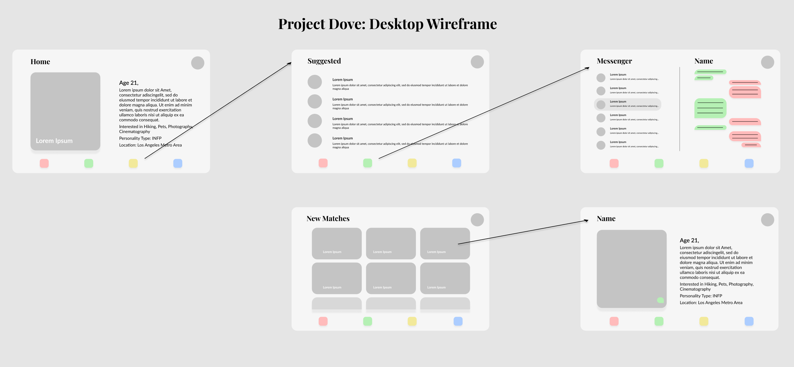

# Project Dove

A dating website to meet and connect with others! It features a front
end built with React and a backend built with NodeJS.

## To Build Project Dove
### Installing Dependencies
First, clone this repository with
```
git clone <url>
```
Then, inside the cloned repository type
```
npm install
```
to install all the required dependencies for the Node server. Then,
```
cd react_dove
npm install
```
to install the required dependencies for the React server.

### Running the Server
Once that is finished, start the node server by navigating back to the main project directory and typing
```
node server/server.js
```
Then, start the React server with
```
cd react_dove
npm start
```